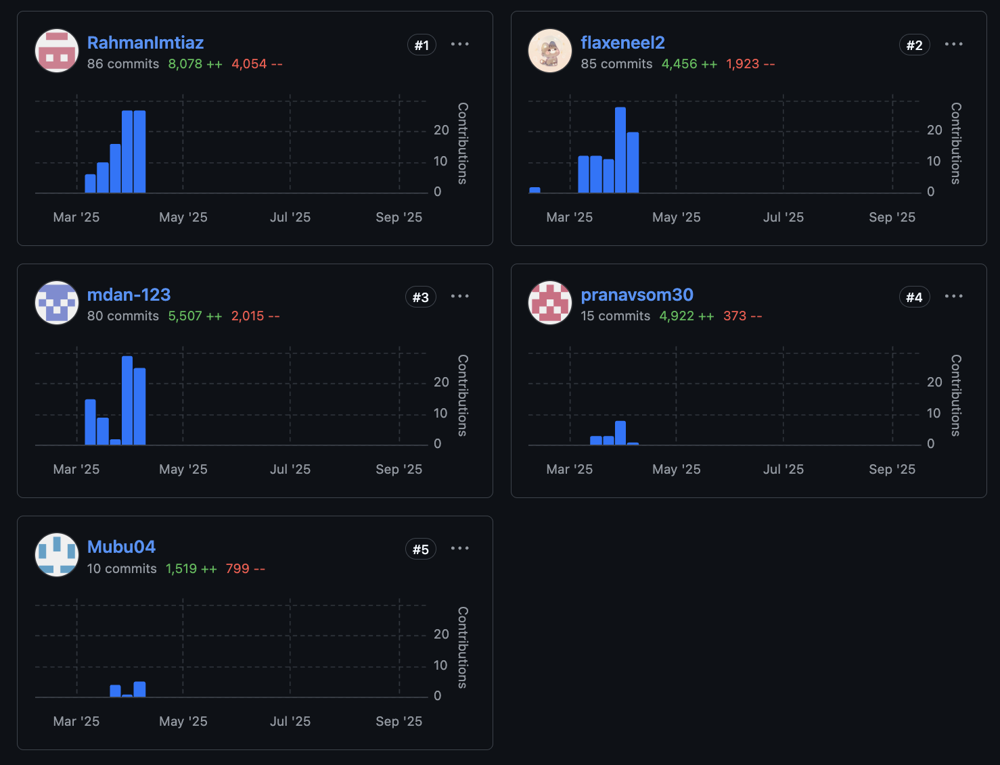

# EncryptoVault


A secure, user-friendly cryptocurrency wallet application with educational features that helps both beginners and advanced users manage their digital assets effectively.

## 📝 Table of Contents
- [Overview](#overview)
- [Features](#features)
- [Technologies Used](#technologies-used)
- [Installation](#installation)
- [Usage](#usage)
- [Project Structure](#project-structure)
- [Security](#security)
- [Screenshots](#screenshots)
- [Contributing](#contributing)
- [License](#license)

## 🔍 Overview

EncryptoVault is a comprehensive desktop cryptocurrency wallet application designed to simplify digital asset management for users of all experience levels. The application provides different modes (Beginner and Advanced) tailored to user expertise, offering educational resources for newcomers while enabling advanced features for experienced cryptocurrency users.

The project combines a modern React frontend with a robust Python backend, providing a secure environment for managing cryptocurrency without compromising on usability.

## ✨ Features

### Wallet Management
- Create and manage multiple Bitcoin and Ethereum wallets
- View detailed wallet information and transaction history
- Generate QR codes for wallet addresses
- Real-time balance updates and cryptocurrency price tracking

### Transactions
- Buy, sell, send, and receive cryptocurrency
- Transaction history with confirmation status
- Transaction details view with blockchain explorer integration

### User Experience
- Beginner and Advanced modes with different feature sets
- Educational resources for cryptocurrency beginners
- Dark and light theme options
- Real-time cryptocurrency price data
- Interactive price charts (line and candlestick formats)

### Security
- WebAuthn/FIDO2 authentication
- Biometric authentication support
- Recovery phrase backup
- Secure wallet creation and management

### Additional Features
- Cryptocurrency market information
- Portfolio overview showing total holdings
- Contact management for frequent transactions
- Feedback system for testers

## 🛠️ Technologies Used

### Frontend
- [React](https://react.dev) - UI library
- [TypeScript](https://www.typescriptlang.org/) - Type-safe JavaScript
- [Vite](https://vitejs.dev) - Build tool
- [ApexCharts](https://apexcharts.com/) - Interactive charts
- [Socket.IO Client](https://socket.io/docs/v4/client-api/) - Real-time communication

### Backend
- [Python](https://www.python.org/) - Backend language
- [PySide6](https://doc.qt.io/qtforpython/PySide6/QtWidgets/index.html) - Qt for Python, UI framework
- [Flask](https://flask.palletsprojects.com/) - Web framework
- [BitcoinLib](https://github.com/1200wd/bitcoinlib) - Bitcoin functionality
- [ECDSA](https://github.com/tlsfuzzer/python-ecdsa) - Cryptographic algorithms
- [Socket.IO](https://socket.io/) - Real-time communication

### Security
- [SimpleWebAuthn](https://simplewebauthn.dev/) - WebAuthn/FIDO2 functionality
- [LocalAuthentication](https://developer.apple.com/documentation/localauthentication) - MacOS biometric authentication
- [Cryptography](https://cryptography.io/) - Cryptographic recipes and primitives
- [Shamir-Mnemonic](https://github.com/trezor/python-shamir-mnemonic) - Seed phrase handling

## 📦 Installation

### Prerequisites
- Python 3.9+
- Node.js 18+
- npm or yarn

### Backend Setup
1. Clone the repository
   ```bash
   git clone https://github.com/your-username/encryptovault.git
   cd encryptovault
   ```

2. Set up Python virtual environment
   ```bash
   python -m venv venv
   source venv/bin/activate  # On Windows, use `venv\Scripts\activate`
   ```

3. Install backend dependencies
   ```bash
   pip install -r requirements.txt
   ```

### Frontend Setup
1. Navigate to the frontend directory
   ```bash
   cd src-frontend
   ```

2. Install frontend dependencies
   ```bash
   npm install
   # or
   yarn install
   ```

## 🚀 Usage

1. Start the backend server
   ```bash
   # From the root directory with virtual environment activated
   python main.py
   ```

2. For development, start the frontend development server
   ```bash
   # From the src-frontend directory
   npm run dev
   # or
   yarn dev
   ```

3. For production, build the frontend
   ```bash
   # From the src-frontend directory
   npm run build
   # or
   yarn build
   ```

### First-time Setup
1. Register a new account or import an existing wallet
2. Choose between Beginner and Advanced modes
3. Set up security features including WebAuthn/biometrics
4. Save your recovery phrase in a secure location

## 📁 Project Structure

```
encryptovault/
├── main.py                   # Application entry point
├── README.md                 # Project documentation
├── requirements.txt          # Python dependencies
├── src-backend/              # Backend Python code
│   ├── api/                  # API endpoints
│   ├── auth/                 # Authentication logic
│   ├── crypto/               # Cryptocurrency operations
│   └── db/                   # Database operations
└── src-frontend/             # Frontend React code
    ├── public/               # Public assets
    ├── src/                  # Source code
    │   ├── components/       # React components
    │   ├── contexts/         # Context providers
    │   ├── lib/              # Utility functions
    │   ├── pages/            # Page components
    │   └── styles/           # CSS styles
    ├── index.html            # HTML entry point
    ├── package.json          # npm/yarn dependencies
    └── vite.config.ts        # Vite configuration
```

## 🔒 Security

EncryptoVault prioritizes security with the following measures:
- WebAuthn/FIDO2 authentication for passwordless login
- Biometric authentication support on compatible devices
- Recovery phrase generation with clear backup instructions
- Secure wallet key generation and storage
- Encrypted local storage for sensitive data

**⚠️ Important:** Always backup your recovery phrase! If you lose access to your device, this is the only way to recover your funds.


## 📄 License

This project is licensed under the MIT License - see the LICENSE file for details.

---

*Developed by the Group 8*
## Contributions:
**Rahman Imtiaz – Major Contributor**
- **Highest number of commits and lines of code** (86 commits, 8,078++ / 4,054--).  
- Implemented core **encryption & decryption logic**, backend features for secure data handling, and major frontend features including macOS biometric authentication, wallet generation and settings page. Contributed across both backend and frontend, integrating key functionalities into the overall system.”
- Contributed heavily to **system architecture, debugging, and optimizations**.  
- Collaborated with 4 other developers in Git workflow and code reviews. 
